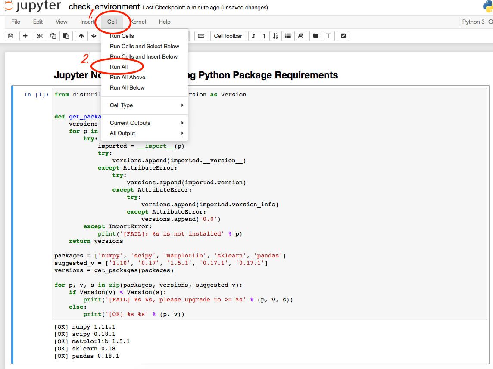

## Resources for setting up your coding environment

- [Instructions for setting up Python and the Jupiter Notebook](./ch01/README.md)  

- A [quick and great NumPy refresher](https://docs.scipy.org/doc/numpy-dev/user/quickstart.html) that covers everything (and more) you'd need for this book

- Recommended! To check your coding environment, open the `check_environment.ipynb` (it can be found in this directory) in Jupyter Notebook and execute the code cell:

## Table of contents and code notebooks

Simply click on the `ipynb`/`nbviewer` links next to the chapter headlines to view the code examples (currently, the internal document links are only supported by the NbViewer version).
**Please note that these are just the code examples accompanying the book, which I uploaded for your convenience; be aware that these notebooks may not be useful without the formulae and descriptive text.**   

 

1. Machine Learning - Giving Computers the Ability to Learn from Data [[dir](./ch01)] [[ipynb](./ch01/ch01.ipynb)] [[nbviewer](http://nbviewer.ipython.org/github/rasbt/python-machine-learning-book/blob/master/code/ch01/ch01.ipynb)]
2. Training Machine Learning Algorithms for Classification [[dir](./ch02)] [[ipynb](./ch02/ch02.ipynb)] [[nbviewer](http://nbviewer.ipython.org/github/rasbt/python-machine-learning-book/blob/master/code/ch02/ch02.ipynb)]
3. A Tour of Machine Learning Classifiers Using Scikit-Learn [[dir](./ch03)] [[ipynb](./ch03/ch03.ipynb)] [[nbviewer](http://nbviewer.ipython.org/github/rasbt/python-machine-learning-book/blob/master/code/ch03/ch03.ipynb)]
4. Building Good Training Sets – Data Pre-Processing [[dir](./ch04)] [[ipynb](./ch04/ch04.ipynb)] [[nbviewer](http://nbviewer.ipython.org/github/rasbt/python-machine-learning-book/blob/master/code/ch04/ch04.ipynb)]
5. Compressing Data via Dimensionality Reduction [[dir](./ch05)] [[ipynb](./ch05/ch05.ipynb)] [[nbviewer](http://nbviewer.ipython.org/github/rasbt/python-machine-learning-book/blob/master/code/ch05/ch05.ipynb)]
6. Learning Best Practices for Model Evaluation and Hyperparameter Optimization [[dir](./ch06)] [[ipynb](./ch06/ch06.ipynb)] [[nbviewer](http://nbviewer.ipython.org/github/rasbt/python-machine-learning-book/blob/master/code/ch06/ch06.ipynb)]
7. Combining Different Models for Ensemble Learning [[dir](./ch07)] [[ipynb](./ch07/ch07.ipynb)] [[nbviewer](http://nbviewer.ipython.org/github/rasbt/python-machine-learning-book/blob/master/code/ch07/ch07.ipynb)]
8. Applying Machine Learning to Sentiment Analysis [[dir](./ch08)] [[ipynb](./ch08/ch08.ipynb)] [[nbviewer](http://nbviewer.ipython.org/github/rasbt/python-machine-learning-book/blob/master/code/ch08/ch08.ipynb)]
9. Embedding a Machine Learning Model into a Web Application [[dir](./ch09)] [[ipynb](./ch09/ch09.ipynb)] [[nbviewer](http://nbviewer.ipython.org/github/rasbt/python-machine-learning-book/blob/master/code/ch09/ch09.ipynb)]
10. Predicting Continuous Target Variables with Regression Analysis [[dir](./ch10)] [[ipynb](./ch10/ch10.ipynb)] [[nbviewer](http://nbviewer.ipython.org/github/rasbt/python-machine-learning-book/blob/master/code/ch10/ch10.ipynb)]
11. Working with Unlabeled Data – Clustering Analysis [[dir](./ch11)] [[ipynb](./ch11/ch11.ipynb)] [[nbviewer](http://nbviewer.ipython.org/github/rasbt/python-machine-learning-book/blob/master/code/ch11/ch11.ipynb)]
12. Training Artificial Neural Networks for Image Recognition [[dir](./ch12)] [[ipynb](./ch12/ch12.ipynb)] [[nbviewer](http://nbviewer.ipython.org/github/rasbt/python-machine-learning-book/blob/master/code/ch12/ch12.ipynb)]
13. Parallelizing Neural Network Training via Theano [[dir](./ch13)] [[ipynb](./ch13/ch13.ipynb)] [[nbviewer](http://nbviewer.ipython.org/github/rasbt/python-machine-learning-book/blob/master/code/ch13/ch13.ipynb)]

 

**Bonus Notebooks (not in the book)**

- Logistic Regression Implementation [[dir](./bonus)] [[ipynb](./bonus/logistic_regression.ipynb)] [[nbviewer](http://nbviewer.ipython.org/github/rasbt/python-machine-learning-book/blob/master/code/bonus/logistic_regression.ipynb)]
- A Basic Pipeline and Grid Search Setup [[dir](./bonus)] [[ipynb](./bonus/svm_iris_pipeline_and_gridsearch.ipynb)] [[nbviewer](http://nbviewer.ipython.org/github/rasbt/python-machine-learning-book/blob/master/code/bonus/svm_iris_pipeline_and_gridsearch.ipynb)]
- An Extended Nested Cross-Validation Example [[dir](./bonus)] [[ipynb](./bonus/nested_cross_validation.ipynb)] [[nbviewer](http://nbviewer.ipython.org/github/rasbt/python-machine-learning-book/blob/master/code/bonus/nested_cross_validation.ipynb)]
- A Simple(r) Barebones Flask Webapp Template [[view directory](./bonus/flask_webapp_ex01)][[download as zip-file](https://github.com/rasbt/python-machine-learning-book/raw/master/code/bonus/flask_webapp_ex01/flask_webapp_ex01.zip)]
- Reading handwritten digits from MNIST into NumPy arrays [[GitHub ipynb](./bonus/reading_mnist.ipynb)] [[nbviewer](http://nbviewer.ipython.org/github/rasbt/python-machine-learning-book/blob/master/code/bonus/reading_mnist.ipynb)]
- Scikit-learn Model Persistence using JSON [[GitHub ipynb](./bonus/scikit-model-to-json.ipynb)] [[nbviewer](http://nbviewer.ipython.org/github/rasbt/python-machine-learning-book/blob/master/code/bonus/scikit-model-to-json.ipynb)]
- Multinomial logistic regression / softmax regression [[GitHub ipynb](./bonus/softmax-regression.ipynb)] [[nbviewer](http://nbviewer.ipython.org/github/rasbt/python-machine-learning-book/blob/master/code/bonus/softmax-regression.ipynb)]

## Contact

I am happy to answer questions! Just write me an [email](mailto:mail@sebastianraschka.com)
or consider asking the question on the [Google Groups Email List](https://groups.google.com/forum/#!forum/python-machine-learning-book).

If you are interested in keeping in touch, I have quite a lively twitter stream ([@rasbt](https://twitter.com/rasbt)) all about data science and machine learning. I also maintain a [blog](http://sebastianraschka.com/articles.html) where I post all of the things I am particularly excited about.
